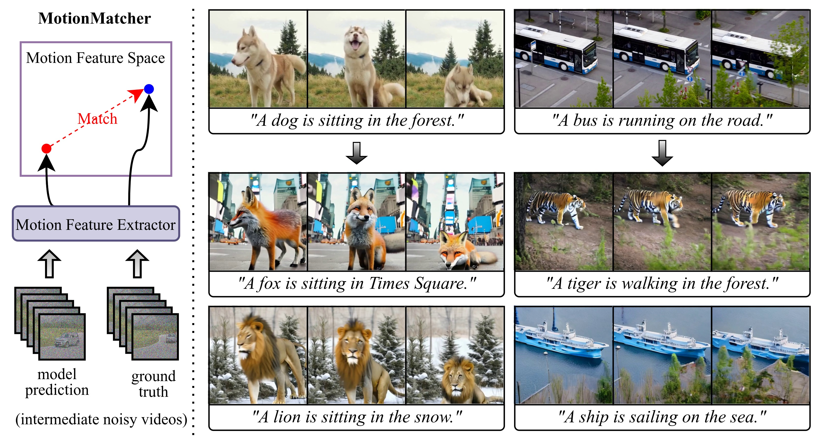

# MotionMatcher: Motion Customization of Text-to-Video Diffusion Models via Motion Feature Matching

<a href="https://b09902097.github.io/motionmatcher/"></a> <a href="TBD"></a>

The implementation of MotionMatcher, a feature-level fine-tuning framework for motion customization.

## 📖 Abstract

> Text-to-video (T2V) diffusion models have shown promising capabilities in synthesizing realistic videos from input text prompts. However, the input text description alone provides limited control over the precise objects movements and camera framing. In this work, we tackle the motion customization problem, where a reference video is provided as motion guidance. While most existing methods choose to fine-tune pre-trained diffusion models to reconstruct the frame differences of the reference video, we observe that such strategy suffer from content leakage from the reference video, and they cannot capture complex motion accurately. To address this issue, we propose MotionMatcher, a motion customization framework that fine-tunes the pre-trained T2V diffusion model at the feature level. Instead of using pixel-level objectives, MotionMatcher compares high-level, spatio-temporal motion features to fine-tune diffusion models, ensuring precise motion learning. For the sake of memory efficiency and accessibility, we utilize a pre-trained T2V diffusion model, which contains considerable prior knowledge about video motion, to compute these motion features. In our experiments, we demonstrate state-of-the-art motion customization performances, validating the design of our framework.



## 🔧 Setup

### Requirements

Install the requirements with the following script:

```shell
# create virtual environment
conda create -n motionmatcher python=3.8 -y
conda activate motionmatcher
# install packages
pip install -r requirements.txt
```

### Pre-trained Weights of Base Model

We use Zeroscope as the base T2V model. Please download the [checkpoint](https://huggingface.co/cerspense/zeroscope_v2_576w) and place it in the `./models` directory:

```shell
git lfs install
git clone https://huggingface.co/cerspense/zeroscope_v2_576w ./zeroscope_v2_576w/
```

## 🎈 Quick Start


### Training

Run the following script for training:
```shell
python train.py --config ./configs/config_gold_fish.yaml
```
The validation results can be found under `./outputs/train/`.

### Inference

Run the following script for inference:
```shell
python inference.py \
        --prompt "Clownfish are swimming in the sea." \
        --checkpoint_folder "/path/to/checkpoint_folder" \
        --checkpoint_index <checkpoint step> \
        --noise_prior 0.3 \
        --output_dir "outputs/inference/gold_fish"
```

### Evaluation

#### CLIP Scores

To compute CLIP-T and frame consistency, run:

```shell
python clip_scores.py --prompt "<text description>" --output_dir /path/to/output_video_folder
```

#### Motion Discrepancy

Follow the instructions [here](https://github.com/facebookresearch/co-tracker) to install Co-Tracker and download their checkpoint under `./evaluation`. After setup, run the following command:

```shell
python motion_discrepancy.py --source_video /path/to/referece_video.mp4 --output_dir /path/to/output_video_folder
```

#### ImageReward

Follow the instructions [here](https://github.com/THUDM/ImageReward.git) to install ImageReward. Once installed, run the following command:

```shell
python imagereward.py --prompt "<text description>" --output_dir /path/to/output_video_folder
```

## 🌏 Citation

```
TBD
```
